# UML Diagrams for Campus Café Management System

This guide explains how to create Use Case and Class diagrams for the Campus Café Management System.

---

## 1. Use Case Diagram

### Actors
1. **Student** (Primary Actor)
2. **Admin** (Primary Actor)
3. **Canteen Staff** (Secondary Actor)
4. **Database System** (Supporting Actor)

### Use Cases for Student

**Authentication:**
- Login to System
- Register Account

**Canteen Operations:**
- View Menu
- Add Items to Cart
- Place Order
- Pay via Wallet

**Wallet Management:**
- Add Money to Wallet
- View Wallet Balance
- View Transaction History

**Mess Plan (Hostellers only):**
- Subscribe to Mess Plan
- View Mess Plan Details
- Change Mess Plan

**Catering:**
- Request Catering for Event
- View Catering Items
- Track Catering Request Status

**Feedback:**
- Submit Feedback
- View Own Feedback History

### Use Cases for Admin

**Menu Management:**
- Add Menu Item
- Update Menu Item
- Delete Menu Item
- View All Menu Items

**Order Management:**
- View All Orders
- Update Order Status

**Catering Management:**
- View Catering Requests
- Approve/Reject Catering Request

**Feedback Management:**
- View All Feedback
- Filter Feedback by Category
- Analyze Feedback Ratings

**Mess Plan Management:**
- View Mess Plans
- View Subscriptions

**Analytics:**
- View Popular Items
- Generate Reports

### Use Cases for Canteen Staff

- View Pending Orders
- Update Order Status (Preparing, Ready, Completed)

### Relationships

**Include Relationships:**
- "Place Order" includes "Pay via Wallet"
- "Subscribe to Mess Plan" includes "Pay via Wallet"
- "Request Catering" includes "View Catering Items"

**Extend Relationships:**
- "Add Money to Wallet" extends "Pay via Wallet" (when balance insufficient)
- "View Transaction History" extends "View Wallet Balance"

**Generalization:**
- Student (Hosteller and Day Scholar inherit from Student)

---

## 2. Class Diagram

### Core Classes and Relationships

#### User Hierarchy (Inheritance)
```
User (Abstract)
├── Student (Abstract)
│   ├── Hosteller
│   └── DayScholar
├── Admin
└── Staff
    ├── CanteenStaff
    └── MessStaff
```

#### Key Classes with Attributes and Methods

**User (Abstract Class)**
- Attributes: userId, name, email
- Methods: getUserId(), getName(), getEmail()

**Student (Abstract Class) extends User**
- Attributes: rollNo, hostelStatus
- Methods: getRollNo(), getHostelStatus()

**Hosteller extends Student**
- Attributes: messplan (MealPlan)
- Methods: subscribeToPlan(), getMessPlan()

**DayScholar extends Student**
- No additional attributes

**Admin extends User**
- Methods: manageMenu(), viewOrders(), manageCatering()

**Wallet**
- Attributes: ownerId, balance
- Methods: addMoney(), deductMoney(), getBalance()
- Relationship: 1-to-1 with Student (Composition)

**Transaction**
- Attributes: transactionId, ownerId, type, amount, description, timestamp
- Methods: getTransactionId(), getAmount(), getType()
- Relationship: Many-to-1 with Wallet (Aggregation)

**MenuItem**
- Attributes: itemId, itemName, unitPrice, category, available
- Methods: getItemId(), getItemName(), getUnitPrice(), getCategory()

**Order**
- Attributes: orderId, customer, items, quantities, status, totalAmount
- Methods: addItem(), removeItem(), calculateBillAmount(), getStatus()
- Relationship: Many-to-1 with Student, Many-to-Many with MenuItem

**MealPlan (Interface/Abstract)**
- Methods: getPlanName(), getCost(), getDescription()
- Implementations: BasicPlan, PremiumPlan, WeekendPlan

**Feedback**
- Attributes: feedbackId, studentId, category, rating, comments
- Methods: getFeedbackId(), getRating(), getCategory()
- Relationship: Many-to-1 with Student

**CateredEvent**
- Attributes: eventId, organizerId, eventName, eventDate, guestCount, status
- Methods: getEventId(), getStatus(), calculateTotal()
- Relationship: Many-to-1 with Student, Many-to-Many with MenuItem

**Club**
- Attributes: clubId, clubName, description, presidentId
- Methods: getClubId(), getClubName()

**DatabaseManager (Utility Class)**
- Methods: getConnection(), authenticateStudent(), authenticateAdmin(), loadMenuItems(), insertOrder(), etc.
- Relationship: Uses all entity classes

### Design Patterns Used

1. **Strategy Pattern**: MealPlan interface with different implementations
2. **Singleton Pattern**: DatabaseManager (connection management)
3. **Factory Pattern**: User creation based on type
4. **Observer Pattern**: Order status updates
5. **Composition**: Student HAS-A Wallet

### Key Relationships

**Association:**
- Student → Order (1 to many)
- Student → Feedback (1 to many)
- Student → CateredEvent (1 to many)
- Admin → manages → MenuItem

**Composition:**
- Student ◆→ Wallet (Student owns Wallet)
- Order ◆→ OrderItems (Order owns items)

**Aggregation:**
- Wallet ◇→ Transaction (Wallet has transactions)
- Order ◇→ MenuItem (Order references menu items)

**Inheritance:**
- Hosteller --|> Student
- DayScholar --|> Student
- BasicPlan --|> MealPlan

---

## 3. How to Draw These Diagrams

### Tools You Can Use

1. **Draw.io (diagrams.net)** - Free, web-based
   - Go to https://app.diagrams.net/
   - Select "UML" templates
   - Drag and drop shapes

2. **Lucidchart** - Free tier available
   - Professional-looking diagrams
   - UML templates included

3. **PlantUML** - Text-based (code to diagram)
   - Write diagram as code
   - Generates professional diagrams

4. **Microsoft Visio** - Professional tool
   - Comprehensive UML support

5. **StarUML** - Dedicated UML tool
   - Free version available

### Drawing Tips

**For Use Case Diagram:**
1. Draw system boundary (rectangle)
2. Place actors (stick figures) outside
3. Add use cases (ovals) inside
4. Connect with lines (associations)
5. Use <<include>> and <<extend>> for relationships
6. Use arrows for generalization

**For Class Diagram:**
1. Draw classes (rectangles with 3 sections)
   - Top: Class name
   - Middle: Attributes
   - Bottom: Methods
2. Show relationships with lines:
   - Solid line: Association
   - Dashed line with arrow: Dependency
   - Solid line with hollow arrow: Inheritance
   - Solid line with diamond: Composition/Aggregation
3. Add multiplicity (1, *, 0..1, 1..*)
4. Show visibility (+ public, - private, # protected)

---

## 4. Specific Diagram Layouts

### Use Case Diagram Layout

```
Left side: Student actor
Right side: Admin actor
Bottom: Canteen Staff actor
Center: System boundary with all use cases
```

### Class Diagram Layout

**Top Layer:** User hierarchy
**Middle Layer:** Core entities (Order, MenuItem, Wallet, Feedback)
**Bottom Layer:** Utility classes (DatabaseManager)
**Side:** Supporting classes (Transaction, Club, CateredEvent)

---

## 5. Example PlantUML Code

If you want to use PlantUML, here's starter code:

### Use Case Diagram (PlantUML)

```plantuml
@startuml
left to right direction
actor Student
actor Admin
actor "Canteen Staff" as Staff

rectangle "Campus Café System" {
  Student -- (Login)
  Student -- (View Menu)
  Student -- (Place Order)
  Student -- (Manage Wallet)
  Student -- (Subscribe to Mess Plan)
  Student -- (Request Catering)
  Student -- (Submit Feedback)
  
  Admin -- (Manage Menu)
  Admin -- (View Orders)
  Admin -- (Manage Catering)
  Admin -- (View Feedback)
  
  Staff -- (Update Order Status)
  
  (Place Order) ..> (Pay via Wallet) : <<include>>
  (Subscribe to Mess Plan) ..> (Pay via Wallet) : <<include>>
}
@enduml
```


### Class Diagram (PlantUML)


---

## 6. Recommended Approach

1. **Start with Use Case Diagram**
   - Identify all actors
   - List all use cases
   - Draw relationships
   - Keep it simple and clear

2. **Then Create Class Diagram**
   - Start with main classes (User, Student, Order, MenuItem)
   - Add relationships
   - Add attributes and methods
   - Show inheritance and composition

3. **Review and Refine**
   - Ensure all features are covered
   - Check relationships are correct
   - Make sure diagram is readable

---

## 7. What to Include in Your Report

1. **Use Case Diagram** showing:
   - All three actors (Student, Admin, Staff)
   - Major use cases for each
   - Include/Extend relationships
   - System boundary

2. **Class Diagram** showing:
   - User hierarchy (inheritance)
   - Core classes (Student, Order, MenuItem, Wallet)
   - Relationships (association, composition, aggregation)
   - Key attributes and methods

3. **Brief Description** of:
   - Each actor's role
   - Main use cases
   - Key classes and their purpose
   - Design patterns used

---

## 8. Simple Text-Based Diagram Instructions

### USE CASE DIAGRAM - What to Draw and Connect

#### Elements to Draw:

**Actors (Stick Figures - Outside the Box):**
- Student (left side)
- Admin (right side)
- Canteen Staff (bottom)

**System Boundary:**
- Draw a large rectangle labeled "Campus Café Management System"

**Use Cases (Ovals - Inside the Box):**

**For Student:**
1. Login
2. Register Account
3. View Menu
4. Place Order
5. Pay via Wallet
6. Add Money to Wallet
7. View Wallet Balance
8. Subscribe to Mess Plan
9. Request Catering
10. Submit Feedback

**For Admin:**
11. Manage Menu
12. View All Orders
13. Manage Catering Requests
14. View Feedback
15. View Analytics

**For Canteen Staff:**
16. Update Order Status

#### Connections (Lines):

**Student connects to:**
- Login (solid line)
- Register Account (solid line)
- View Menu (solid line)
- Place Order (solid line)
- Add Money to Wallet (solid line)
- View Wallet Balance (solid line)
- Subscribe to Mess Plan (solid line)
- Request Catering (solid line)
- Submit Feedback (solid line)

**Admin connects to:**
- Login (solid line)
- Manage Menu (solid line)
- View All Orders (solid line)
- Manage Catering Requests (solid line)
- View Feedback (solid line)
- View Analytics (solid line)

**Canteen Staff connects to:**
- Login (solid line)
- Update Order Status (solid line)

**Special Relationships (Dashed arrows with <<include>>):**
- "Place Order" → "Pay via Wallet" (dashed arrow with <<include>>)
- "Subscribe to Mess Plan" → "Pay via Wallet" (dashed arrow with <<include>>)

---

### CLASS DIAGRAM - What to Draw and Connect

#### Main Classes to Draw (Rectangles with 3 sections):

**1. User (Abstract - italicize name)**
```
┌─────────────────┐
│      User       │ (abstract)
├─────────────────┤
│ - userId        │
│ - name          │
│ - email         │
├─────────────────┤
│ + getUserId()   │
│ + getName()     │
└─────────────────┘
```

**2. Student (Abstract - italicize name)**
```
┌─────────────────┐
│    Student      │ (abstract)
├─────────────────┤
│ - rollNo        │
│ - hostelStatus  │
├─────────────────┤
│ + getRollNo()   │
└─────────────────┘
```

**3. Hosteller**
```
┌─────────────────┐
│   Hosteller     │
├─────────────────┤
│ - messplan      │
├─────────────────┤
│ + subscribeTo() │
└─────────────────┘
```

**4. DayScholar**
```
┌─────────────────┐
│   DayScholar    │
├─────────────────┤
│                 │
├─────────────────┤
│                 │
└─────────────────┘
```

**5. Admin**
```
┌─────────────────┐
│     Admin       │
├─────────────────┤
│                 │
├─────────────────┤
│ + manageMenu()  │
└─────────────────┘
```

**6. Wallet**
```
┌─────────────────┐
│     Wallet      │
├─────────────────┤
│ - ownerId       │
│ - balance       │
├─────────────────┤
│ + addMoney()    │
│ + deductMoney() │
└─────────────────┘
```

**7. Order**
```
┌─────────────────┐
│     Order       │
├─────────────────┤
│ - orderId       │
│ - customer      │
│ - items         │
│ - status        │
├─────────────────┤
│ + addItem()     │
│ + calculate()   │
└─────────────────┘
```

**8. MenuItem**
```
┌─────────────────┐
│   MenuItem      │
├─────────────────┤
│ - itemId        │
│ - itemName      │
│ - price         │
│ - category      │
├─────────────────┤
│ + getPrice()    │
└─────────────────┘
```

**9. MealPlan (Interface)**
```
┌─────────────────┐
│  <<interface>>  │
│    MealPlan     │
├─────────────────┤
│ + getCost()     │
│ + getDetails()  │
└─────────────────┘
```

**10. BasicPlan, PremiumPlan, WeekendPlan**
```
┌─────────────┐  ┌──────────────┐  ┌──────────────┐
│ BasicPlan   │  │ PremiumPlan  │  │ WeekendPlan  │
└─────────────┘  └──────────────┘  └──────────────┘
```

**11. Feedback**
```
┌─────────────────┐
│   Feedback      │
├─────────────────┤
│ - feedbackId    │
│ - studentId     │
│ - rating        │
│ - comments      │
├─────────────────┤
│ + getRating()   │
└─────────────────┘
```

#### Connections (Relationships):

**INHERITANCE (Hollow arrow pointing to parent):**
1. Student → User (hollow arrow from Student to User)
2. Hosteller → Student (hollow arrow from Hosteller to Student)
3. DayScholar → Student (hollow arrow from DayScholar to Student)
4. Admin → User (hollow arrow from Admin to User)
5. BasicPlan → MealPlan (dashed hollow arrow)
6. PremiumPlan → MealPlan (dashed hollow arrow)
7. WeekendPlan → MealPlan (dashed hollow arrow)

**COMPOSITION (Filled diamond on owner side):**
1. Student ◆——— Wallet (filled diamond on Student side, line to Wallet)
   - Label: "1" near Student, "1" near Wallet

**ASSOCIATION (Simple line):**
1. Student ——— Order (line between them)
   - Label: "1" near Student, "*" near Order
   - Label on line: "places"

2. Student ——— Feedback (line between them)
   - Label: "1" near Student, "*" near Feedback
   - Label on line: "submits"

3. Order ——— MenuItem (line between them)
   - Label: "*" near Order, "*" near MenuItem
   - Label on line: "contains"

4. Hosteller ——— MealPlan (line between them)
   - Label: "1" near Hosteller, "1" near MealPlan
   - Label on line: "subscribes to"

---

### Quick Drawing Steps:

#### For Use Case Diagram:
1. Draw big rectangle (system boundary)
2. Put 3 stick figures outside (Student left, Admin right, Staff bottom)
3. Draw ovals inside for each use case
4. Connect actors to their use cases with straight lines
5. Add dashed arrows for <<include>> relationships

#### For Class Diagram:
1. Draw all class boxes (rectangles with 3 sections)
2. Arrange: User at top, Student below, Hosteller/DayScholar below Student
3. Draw hollow arrows for inheritance (pointing upward)
4. Draw filled diamond + line for Student-Wallet composition
5. Draw simple lines for associations (Student-Order, Student-Feedback, etc.)
6. Add multiplicity numbers (1, *, etc.) near the lines

---

Good luck with your diagrams! 🎨
