# UML Diagrams for Campus Café Management System

This guide explains how to create Use Case and Class diagrams for the Campus Café Management System.

---

## 1. Use Case Diagram

### Actors
1. **Student** (Primary Actor)
2. **Admin** (Primary Actor)
3. **Canteen Staff** (Secondary Actor)
4. **Database System** (Supporting Actor)

### Use Cases for Student

**Authentication:**
- Login to System
- Register Account

**Canteen Operations:**
- View Menu
- Add Items to Cart
- Place Order
- Pay via Wallet

**Wallet Management:**
- Add Money to Wallet
- View Wallet Balance
- View Transaction History

**Mess Plan (Hostellers only):**
- Subscribe to Mess Plan
- View Mess Plan Details
- Change Mess Plan

**Catering:**
- Request Catering for Event
- View Catering Items
- Track Catering Request Status

**Feedback:**
- Submit Feedback
- View Own Feedback History

### Use Cases for Admin

**Menu Management:**
- Add Menu Item
- Update Menu Item
- Delete Menu Item
- View All Menu Items

**Order Management:**
- View All Orders
- Update Order Status

**Catering Management:**
- View Catering Requests
- Approve/Reject Catering Request

**Feedback Management:**
- View All Feedback
- Filter Feedback by Category
- Analyze Feedback Ratings

**Mess Plan Management:**
- View Mess Plans
- View Subscriptions

**Analytics:**
- View Popular Items
- Generate Reports

### Use Cases for Canteen Staff

- View Pending Orders
- Update Order Status (Preparing, Ready, Completed)

### Relationships

**Include Relationships:**
- "Place Order" includes "Pay via Wallet"
- "Subscribe to Mess Plan" includes "Pay via Wallet"
- "Request Catering" includes "View Catering Items"

**Extend Relationships:**
- "Add Money to Wallet" extends "Pay via Wallet" (when balance insufficient)
- "View Transaction History" extends "View Wallet Balance"

**Generalization:**
- Student (Hosteller and Day Scholar inherit from Student)

---

## 2. Class Diagram

### Core Classes and Relationships

#### User Hierarchy (Inheritance)
```
User (Abstract)
├── Student (Abstract)
│   ├── Hosteller
│   └── DayScholar
├── Admin
└── Staff
    ├── CanteenStaff
    └── MessStaff
```

#### Key Classes with Attributes and Methods

**User (Abstract Class)**
- Attributes: userId, name, email
- Methods: getUserId(), getName(), getEmail()

**Student (Abstract Class) extends User**
- Attributes: rollNo, hostelStatus
- Methods: getRollNo(), getHostelStatus()

**Hosteller extends Student**
- Attributes: messplan (MealPlan)
- Methods: subscribeToPlan(), getMessPlan()

**DayScholar extends Student**
- No additional attributes

**Admin extends User**
- Methods: manageMenu(), viewOrders(), manageCatering()

**Wallet**
- Attributes: ownerId, balance
- Methods: addMoney(), deductMoney(), getBalance()
- Relationship: 1-to-1 with Student (Composition)

**Transaction**
- Attributes: transactionId, ownerId, type, amount, description, timestamp
- Methods: getTransactionId(), getAmount(), getType()
- Relationship: Many-to-1 with Wallet (Aggregation)

**MenuItem**
- Attributes: itemId, itemName, unitPrice, category, available
- Methods: getItemId(), getItemName(), getUnitPrice(), getCategory()

**Order**
- Attributes: orderId, customer, items, quantities, status, totalAmount
- Methods: addItem(), removeItem(), calculateBillAmount(), getStatus()
- Relationship: Many-to-1 with Student, Many-to-Many with MenuItem

**MealPlan (Interface/Abstract)**
- Methods: getPlanName(), getCost(), getDescription()
- Implementations: BasicPlan, PremiumPlan, WeekendPlan

**Feedback**
- Attributes: feedbackId, studentId, category, rating, comments
- Methods: getFeedbackId(), getRating(), getCategory()
- Relationship: Many-to-1 with Student

**CateredEvent**
- Attributes: eventId, organizerId, eventName, eventDate, guestCount, status
- Methods: getEventId(), getStatus(), calculateTotal()
- Relationship: Many-to-1 with Student, Many-to-Many with MenuItem

**Club**
- Attributes: clubId, clubName, description, presidentId
- Methods: getClubId(), getClubName()

**DatabaseManager (Utility Class)**
- Methods: getConnection(), authenticateStudent(), authenticateAdmin(), loadMenuItems(), insertOrder(), etc.
- Relationship: Uses all entity classes

### Design Patterns Used

1. **Strategy Pattern**: MealPlan interface with different implementations
2. **Singleton Pattern**: DatabaseManager (connection management)
3. **Factory Pattern**: User creation based on type
4. **Observer Pattern**: Order status updates
5. **Composition**: Student HAS-A Wallet

### Key Relationships

**Association:**
- Student → Order (1 to many)
- Student → Feedback (1 to many)
- Student → CateredEvent (1 to many)
- Admin → manages → MenuItem

**Composition:**
- Student ◆→ Wallet (Student owns Wallet)
- Order ◆→ OrderItems (Order owns items)

**Aggregation:**
- Wallet ◇→ Transaction (Wallet has transactions)
- Order ◇→ MenuItem (Order references menu items)

**Inheritance:**
- Hosteller --|> Student
- DayScholar --|> Student
- BasicPlan --|> MealPlan

---

## 3. How to Draw These Diagrams

### Tools You Can Use

1. **Draw.io (diagrams.net)** - Free, web-based
   - Go to https://app.diagrams.net/
   - Select "UML" templates
   - Drag and drop shapes

2. **Lucidchart** - Free tier available
   - Professional-looking diagrams
   - UML templates included

3. **PlantUML** - Text-based (code to diagram)
   - Write diagram as code
   - Generates professional diagrams

4. **Microsoft Visio** - Professional tool
   - Comprehensive UML support

5. **StarUML** - Dedicated UML tool
   - Free version available

### Drawing Tips

**For Use Case Diagram:**
1. Draw system boundary (rectangle)
2. Place actors (stick figures) outside
3. Add use cases (ovals) inside
4. Connect with lines (associations)
5. Use <<include>> and <<extend>> for relationships
6. Use arrows for generalization

**For Class Diagram:**
1. Draw classes (rectangles with 3 sections)
   - Top: Class name
   - Middle: Attributes
   - Bottom: Methods
2. Show relationships with lines:
   - Solid line: Association
   - Dashed line with arrow: Dependency
   - Solid line with hollow arrow: Inheritance
   - Solid line with diamond: Composition/Aggregation
3. Add multiplicity (1, *, 0..1, 1..*)
4. Show visibility (+ public, - private, # protected)

---

## 4. Specific Diagram Layouts

### Use Case Diagram Layout

```
Left side: Student actor
Right side: Admin actor
Bottom: Canteen Staff actor
Center: System boundary with all use cases
```

### Class Diagram Layout

**Top Layer:** User hierarchy
**Middle Layer:** Core entities (Order, MenuItem, Wallet, Feedback)
**Bottom Layer:** Utility classes (DatabaseManager)
**Side:** Supporting classes (Transaction, Club, CateredEvent)

---

## 5. Example PlantUML Code

If you want to use PlantUML, here's starter code:

### Use Case Diagram (PlantUML)

```plantuml
@startuml
left to right direction
actor Student
actor Admin
actor "Canteen Staff" as Staff

rectangle "Campus Café System" {
  Student -- (Login)
  Student -- (View Menu)
  Student -- (Place Order)
  Student -- (Manage Wallet)
  Student -- (Subscribe to Mess Plan)
  Student -- (Request Catering)
  Student -- (Submit Feedback)
  
  Admin -- (Manage Menu)
  Admin -- (View Orders)
  Admin -- (Manage Catering)
  Admin -- (View Feedback)
  
  Staff -- (Update Order Status)
  
  (Place Order) ..> (Pay via Wallet) : <<include>>
  (Subscribe to Mess Plan) ..> (Pay via Wallet) : <<include>>
}
@enduml
```


### Class Diagram (PlantUML)


---

## 6. Recommended Approach

1. **Start with Use Case Diagram**
   - Identify all actors
   - List all use cases
   - Draw relationships
   - Keep it simple and clear

2. **Then Create Class Diagram**
   - Start with main classes (User, Student, Order, MenuItem)
   - Add relationships
   - Add attributes and methods
   - Show inheritance and composition

3. **Review and Refine**
   - Ensure all features are covered
   - Check relationships are correct
   - Make sure diagram is readable

---

## 7. What to Include in Your Report

1. **Use Case Diagram** showing:
   - All three actors (Student, Admin, Staff)
   - Major use cases for each
   - Include/Extend relationships
   - System boundary

2. **Class Diagram** showing:
   - User hierarchy (inheritance)
   - Core classes (Student, Order, MenuItem, Wallet)
   - Relationships (association, composition, aggregation)
   - Key attributes and methods

3. **Brief Description** of:
   - Each actor's role
   - Main use cases
   - Key classes and their purpose
   - Design patterns used

---

Good luck with your diagrams! 🎨
